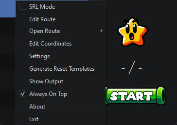

<h1 align="center"> AutoSplit64+ </h1> 

    

## Introduction
AutoSplit64+ is an enhanced fork of [AutoSplit64](https://github.com/Kainev/AutoSplit64), providing automated splitting for Super Mario 64 speedruns on console. It analyzes captured gameplay to control LiveSplit timer events automatically.

## Key Features
### Core Functionality
- Automatic split timing
- Console reset detection
- Star count detection
- DDD entry, Final star, X-Cam and Death detection
- Custom route creation
- LiveSplit .lss file conversion

### AS64+ Enhancements
- **Direct OBS Integration**
  - Native OBS capture support via Plugin
  - Changing size, switching scenes, adding Overlays, etc. dont influence the capture
  - AmaRecTV is no longer required
- **Streamlined Setup**
  - Automatic LiveSplit Server connection
  - No manual server configuration needed
- **Improved Recognition**
  - Enhanced star detection accuracy
  - Resilient to inaccurate capture region 
  - Automatic capture region detection

## System Requirements
- Windows 10 or later
- LiveSplit 1.8.29 or newer
- OBS Studio 30.0 or newer (for OBS integration)
- Capture device/card

## Quick Setup

1. Download the latest [Release](https://github.com/DaviBe92/AutoSplit64/releases).
2. Extract contents and run `AutoSplit64plus.exe`.
3. Set LiveSplit to start at 1.36 seconds.
4. Set Game Capture method and region.
5. Generate Reset Templates.
6. Press Start.

### Interface

All windows and options are accessed via the right-click menu:

## Usage Guide

### LiveSplit

AutoSplit64+ directly communicates with LiveSplit using a Named Pipe. There is no need to manually start the LiveSplit Server.

Since AS64+ recognizes the reset only when the Super Mario 64 logo appears, we need to set the Timer to Start at 1.36 seconds.

In LiveSplit `Right-Click -> Edit Splits...` &rarr; Set `Start Timer at:` to **1.36**

### Game Capture

There are 2 options to capture the game:
- **OBS Plugin** (*preffered*)
- **Window Capture** 

Make sure you have your capture software open (i.e., OBS, AmaRecTV), then open the Capture Editor (`Right-Click -> Edit Coordinates`):

#### OBS Plugin

The AutoSplit64+ Grabber OBS plugin sends the gameplay directly to AutoSplit64+ before any modifications are done to it. Changing size, adding effects, overlays, etc. are not captured do not influence the result. 

##### Install Plugin:
- Close OBS
- Copy the plugin file `as64plus-grabber.dll` located in `AutpSplit64plus/OBS-Plugin` to your OBS plugin folder
- Usually located in `C:\Program Files\obs-studio\obs-plugins\64bit`
- Open OBS

- Check `Use OBS Plugin`
- Pressing `Capture Screen` will update the shown frame.
- Make sure a frame in a bright environment is shown, like the one above.
- Pressing `Auto Detect Region` should correctly position the `Game Region selector` as shown. 

If the region was not detected poperly, adjust the region manually and ensure it is as accurate as possible for best results. When in doubt, its better to select 1-2 pixels into the game as shown above. Selecting even 1 pixel outside of the game area will cause issues!

- Press `Apply` to save changes.

#### Window Capture
Window Capture will take a screenshot of the selected programm 30 times/second.
 

- Uncheck `Use OBS Plugin`
- Select the desired process from the `Process` drop-down.
- Pressing `Capture Screen` will update the shown frame.
- Make sure a frame in a bright environment is shown, like the one above.
- When using AmaRecTV, pressing `Auto Detect Region` should correctly position the `Game Region selector` as shown. 

When capturing another progamm or the region was not detected poperly, adjust the region manually and ensure it is as accurate as possible for best results. When in doubt, its better to select 1-2 pixels into the game as shown above. Selecting even 1 pixel outside of the game area will cause issues!

- Press `Apply` to save changes.

**NOTE:**
If you are using a correctly configured version of AmaRecTV as shown (with windows size at 100% `Right-Click AmaRecTV -> 100%`), the default settings should already be set appropriately.

### Routes

We must let AutoSplit 64 know when we want splits to occur. This can be done by using the Route Editor (`Right-Click -> Edit Route`) to generate route files.

A regular split will trigger when the specified number of stars have been collected, and a set amount of fadeouts or fadeins have occurred after the star count was reached, or the last split occurred.

Every time a star is collected, or a split, undo or skip is triggered, the fadeout and fadein count are reset to 0.
The Route Editor has been designed to look and function similar to the split editor found in LiveSplit to make it as familiar as possible.

**The easiest method of creating routes is to import your splits you use for LiveSplit. To do this, in the Route Editor, nagivate to `File -> Convert LSS`. Open the `.lss` file you use with LiveSplit. AutoSplit 64 will attempt to fill in as many details as possible to simplify the route creation process, however it is important you check each split to make sure it is correct.**

## Troubleshooting

If you encounter any issues, please run through all steps below.

- Check capture coordinates are correct (`Right Click -> Edit Coordinates`)
- When using TCP connection, ensure LiveSplit server is running (`Right Click LiveSplit -> Control -> Start Server')
- Check the correct route is loaded, and that the route file is accurate (i.e. correct star counts, fadeout/fadein counts)
- Make sure SRL Mode (Right Click -> SRL Mode) is disabled if you want AutoSplit64 to detect console resets
- Generate reset templates (`Right Click -> Generate Reset Templates`)
- Enlarge your game capture window if it is very small
- Make sure the captures colour settings (i.e. saturation) are default or close to default
- If using an unpowered splitter, compare the whiteness of your star select screens to other players. If it is extremely dull you may need to increase your capture brightness
- Ensure your capture is set to a 4:3 aspect ratio (or close to)

## Development
### Requirements
- Python 3.12.8
- Dependencies listed in `requirements.txt`

### Building
1. Clone the repository
2. Install dependencies: `pip install -r requirements.txt`
3. Run `build.bat` to create executable

## Support
- For support on the new Plus Features: [Join our Discord](https://discord.gg/VmrQQBpPSK)
- For support on base Features: [Join the AutoSplit64 Discord](https://discord.gg/Q4TrSqB)

## Credits
Developed with ❤️ by [Davi Be](https://github.com/DaviBe92)

Synozure - [AutoSplit64](https://github.com/Kainev/AutoSplit64)

Gerardo Cervantes - [Star Classifier](https://github.com/gerardocervantes8/Star-Classifier-For-Mario-64)

#### TODO

- Autostart detecting
- RetroSpy integration for reset detection
